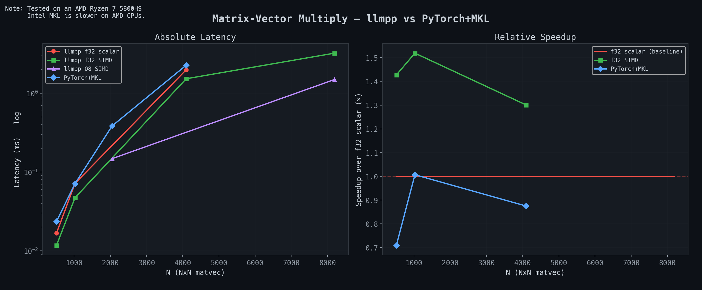
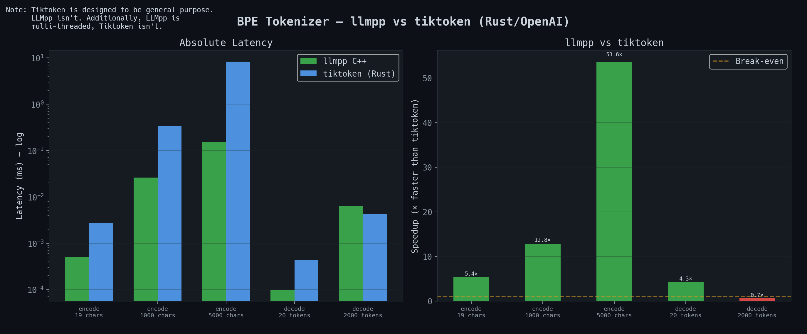

# llmpp

llm inference engine from scratch in c++ with no ai/ml dependencies. it includes a
custom tensor library with hand tuned avx2 simd, int8 quantization, bpe tokenizer, and
a chat interface. runs transformer models (chatml format) on cpu.

currently it has these features:

- custom tensor library with strided buffer engine
- hand optimized avx2 simd matvec that gets within ~1.5x of intel mkl (at least on amd because mkl is petty and a lot faster on intel cpus... god damn you intel)
- int8 weight quantization (`--q8`)
- bpe tokenizer (loads huggingface `tokenizer.json`)
- multi threaded inference
- interactive chat with streaming output and conversation history
- chatml prompt format (`im_start`/`im_end`)
- sampling with temperature, top k, top p, and repetition penalty
- safetensors model loading

## how fast

the simd matvec for 4096x4096 hits ~1.8-1.9ms avg on ddr4 3200 dual channel, which is
approaching the theoretical memory bandwidth floor of ~1.6ms (64mb/40gb/s). it's very
memory bound. [maths behind the number](#oh-yeah-also)





## installation

### stuff you need

- g++/clang++ with c++20 support
- make
- x86_64 cpu with avx2 (for simd)

### build

1) clone the repo:

   ```bash
   git clone https://github.com/TheUnium/llmpp.git
   cd llmpp
   ```

2) build:

   ```bash
   make
   ```

3) run:

   ```bash
   ./llm <model_dir> <tokenizer.json> [options]
   ```

### running tests

```bash
make tests
./llm_tests # this runs all tests
./llm_tests --tests tensor/simd # this runs the specified tests
```

available test modules: `tensor/tensor`, `tensor/ops`, `tensor/simd`, `tensor/qnt8`, `thread/thread`, `tokenizer/bpe`

## usage

```
usage:
  ./llm <model_dir> <tokenizer.json> [options]

options:
  --q8                  quantize weights to int8
  --max-tokens <int>    max generation tokens (default: 512)
  --temp <float>        temperature (default: 0.7)
  --top-k <int>         top-k (default: 40)
  --top-p <float>       top-p (default: 0.9)
  --rep-penalty <float> repetition penalty (default: 1.2)
  --system <string>     system prompt (default: built-in)
```

chat commands: `/quit`, `/clear`, `/help`

## structure

all the code is in `src/`

- `src/Tensor/` : tensor library (storage, ops, simd kernels, int8 quantization)
- `src/Model/` : model loading (safetensors) and inference (forward pass, sampling)
- `src/Tokenizer/` : bpe tokenizer
- `src/Thread/` : thread pool
- `src/Tests/` : test suite + benchmarks
- `src/main.cpp` : chat interface
- `src/tests.cpp` : test runner

## stuff used

- c++20
- make
- avx2 intrinsics
- nothing else (that's the point)

# oh yeah also...

from [here](https://github.com/TheUnium/llmpp/commit/7b4f806a79303e4dcb363398494067c2209cbca8):
i am ALMOST hitting (kinda) the limit, i have ddr4 3200 dual channel mem and absolute peak would be ~51gbs
(3200mhz\*2(dc)\*8(b)) but realistically it should be like ~40gbs (~70-80% eff). the mat read is like
4096\*4096\*4(b)=64mb, vec read is16kb (fits in cache so meh) and output write is also 16kb so its neglible
butttt since mat read is 16mb im streaming 64mb from dram every call

i did some more maths and theoretically the mem floor would be ~1.6ms but thats not really THAT possible tbh.
so basically flops per matvec should be 4096\*4096\*2 (one mult + one add) so thats ~33.6mflop, and the peak
fp32 throughput should be ~51.2gflop (single core avx2 bc ~3.2ghz*16f/c) the mem bound time is like 1.6ms
(64mb/40gbs) and compute bound time is 0.00066ms bc ({33.6\*10^6 flop}/{51.2\*10^9 flop/s}) it is VERY memory
bound bc like the roofline crossover point for my cpu is ~1.3flop/b


